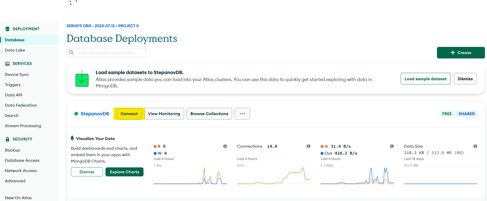

# GoIT_WEB_HW_9
Individual homework №9 at GoIT school: **WEB Scraping - `requests` + `bs4`, `MongoDB`**

## Description 

This program is written for educational purposes. It parses the [quotes.toscrape.com](http://quotes.toscrape.com/) website, saves the data into json files, and then from the json files into a MongoDB database. `MongoDB Atlas` cloud database is used in this process.

## Running the program

To start working with this project, you need to have access to **`MongoDB`**. For example, you can use the `Atlas MongoDB` cloud service or use `Docker` on your local machine.

• Clone this repository to your computer. To do this, run a command prompt and type
```
git clone https://github.com/S-Stepanov-1/GoIT_WEB_HW_9.git
```
• Then you need to install the dependencies:
```
poetry install
```
• Now you can run the script to collect data (web parsing) from the web site:
```
py main.py
```
or
```
python main.py
```
This will save the data to `authors.json` and `quotes.json` files.
### Authors file


### Quotes file


• After that you can save the data from the files to your database. 
### MongoDB

To do this you need to run the `upload_to_DB.py` script.
```
py upload_to_DB.py
```
or
```
python upload_to_DB.py
```
**But before running this program you need to set up access to the database.**
To do this you need to either start a Docker container with Mongo database or register at [cloud.mongodb.com](https://cloud.mongodb.com/) and get access to Mongo database that way. In either case you need to change some data in the `config.ini` file, namely specify USER, PASS and DB_NAME. After that you will also need to change the host name in the connect.py file. You can get the correct host name from either Docker Container or Atlas MongoDB.
For example, in Atlas MongoDB you need to click the connect tab next to your database name and then click Drivers. Once you do that, you will see the `host` name.
### Click `Connect` tab


### Choose `Drivers`


### Copy your host name

